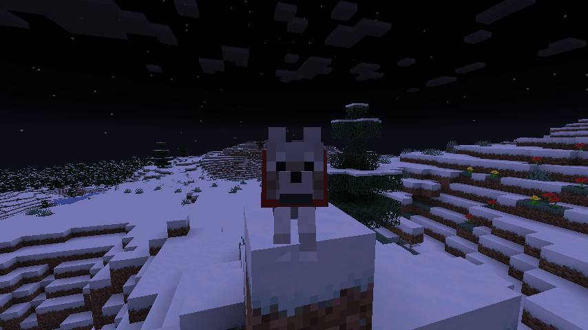
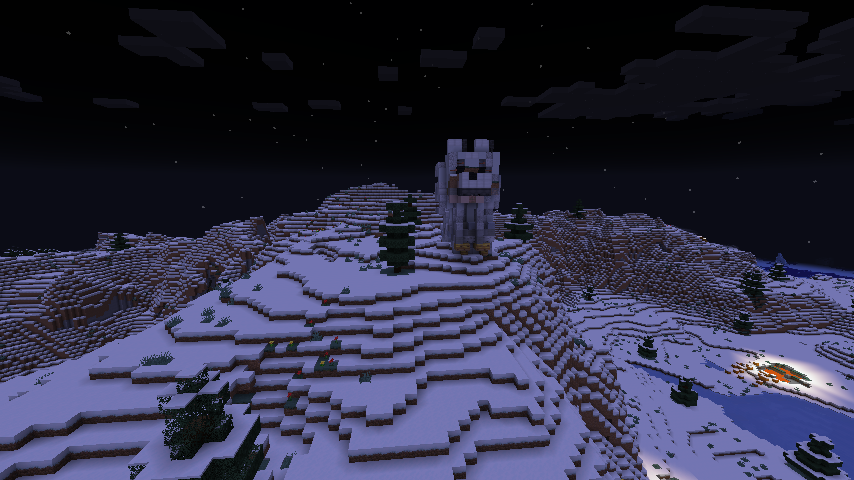
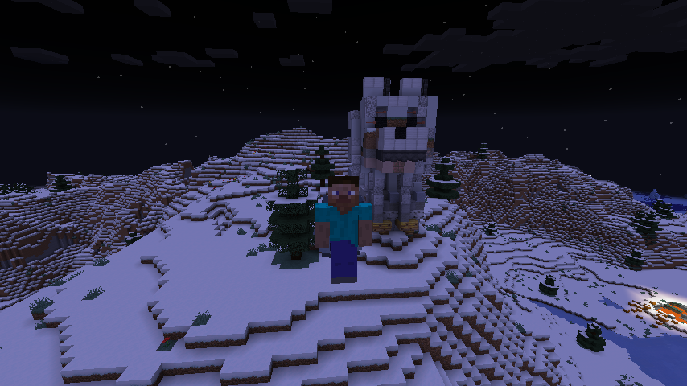

# Entity Builder

Ever wanted to capture the moment your dog sits down and looks at you?
Now you can. Use this mod and build a statue.
No matter where you take your dog, the blocks stay where they are.

## Installation

1. Install Fabric
2. Put [Fabric API](https://www.curseforge.com/minecraft/mc-mods/fabric-api) and this mod in the mods folder (both server and client)
3. Optional: Install WorldEdit

## Usage

`/build <entity> [position] [scale]`

Example: dog above you

`/build @e[limit=1,type=minecraft:wolf] ~ ~2 ~`

## Images

## Technical

This mod renders the entity with a custom VertexConsumer, collecting all vertices. Then we interpolate between the vertices, take the
pixel from the entity's texture and map it to a block state. All those block states are then sent to the server together with their
position.
